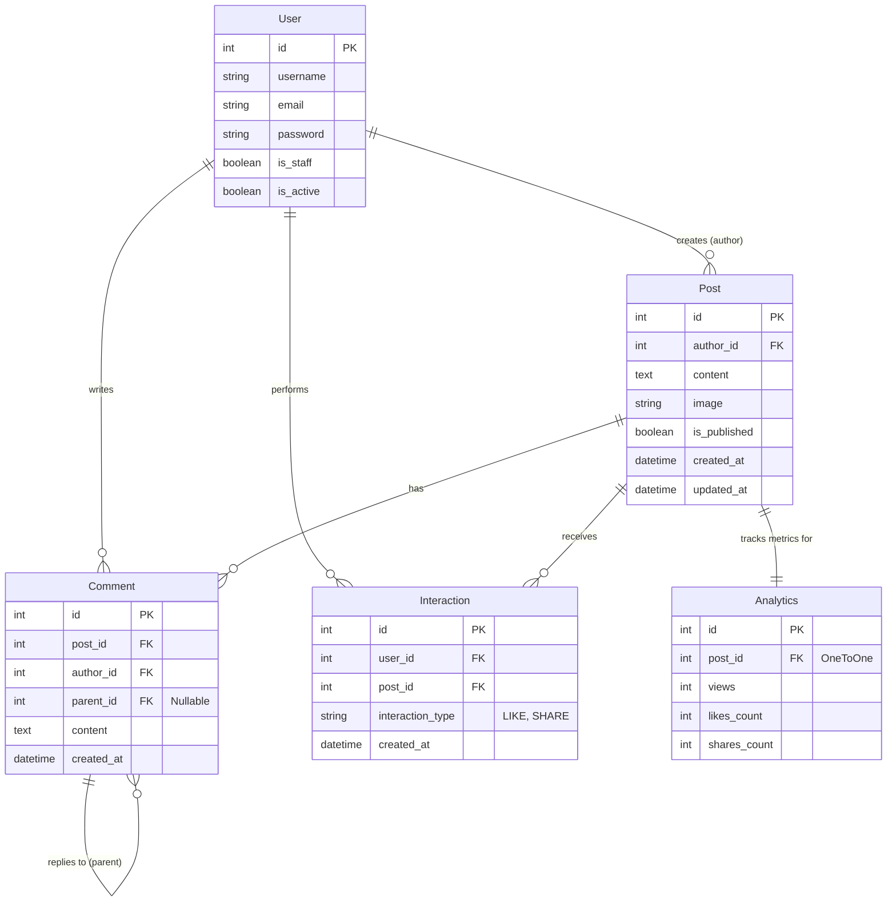

# Data Models Entity Relationship Diagram


```mermaid
erDiagram
    User ||--o{ Post : "creates (author)"
    User ||--o{ Comment : "writes"
    User ||--o{ Interaction : "performs"
    
    Post ||--o{ Comment : "has"
    Post ||--o{ Interaction : "receives"
    Post ||--|| Analytics : "tracks metrics for"
    
    Comment ||--o{ Comment : "replies to (parent)"

    User {
        int id PK
        string username
        string email
        string password
        boolean is_staff
        boolean is_active
    }

    Post {
        int id PK
        int author_id FK
        text content
        string image
        boolean is_published
        datetime created_at
        datetime updated_at
    }

    Comment {
        int id PK
        int post_id FK
        int author_id FK
        int parent_id FK "Nullable"
        text content
        datetime created_at
    }

    Interaction {
        int id PK
        int user_id FK
        int post_id FK
        string interaction_type "LIKE, SHARE"
        datetime created_at
    }

    Analytics {
        int id PK
        int post_id FK "OneToOne"
        int views
        int likes_count
        int shares_count
    }
```
        int post_id FK
        int views
        int likes_count
        int shares_count
    }
```
