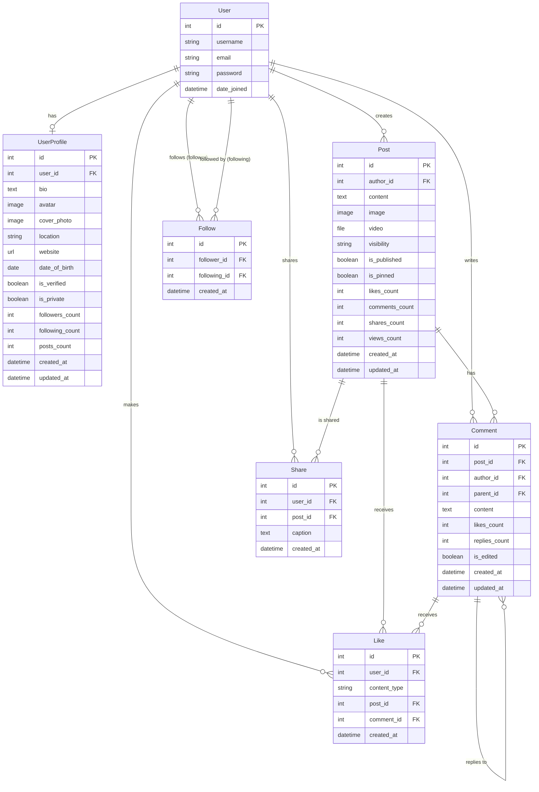

# Database ERD - Core App

## Entity Relationship Diagram

## Table Relationships Summary

### UserProfile
- **One-to-One** with User
- Stores extended profile information
- Auto-created on user registration

### Follow
- **Many-to-Many** relationship through custom table
- Links User as `follower` → User as `following`
- Prevents self-follows
- Unique constraint on (follower, following)

### Post
- **Many-to-One** with User (author)
- **One-to-Many** with Comment
- **One-to-Many** with Like
- **One-to-Many** with Share

### Comment
- **Many-to-One** with Post
- **Many-to-One** with User (author)
- **Self-referential Many-to-One** with Comment (parent)
- **One-to-Many** with Like
- Supports nested comment threads

### Like
- **Many-to-One** with User
- **Many-to-One** with Post (optional)
- **Many-to-One** with Comment (optional)
- Polymorphic-style: can like either Post or Comment

### Share
- **Many-to-One** with User
- **Many-to-One** with Post
- Allows resharing with optional caption

## Indexes

### Follow
- `(follower, created_at)` - Get who user follows
- `(following, created_at)` - Get user's followers

### Post
- `(author, created_at)` - User's posts timeline
- `(is_published, created_at)` - Public feed
- `(likes_count)` - Trending posts

### Comment
- `(post, created_at)` - Comments on a post
- `(parent, created_at)` - Replies to a comment

### Like
- `(post, created_at)` - Post's likes
- `(comment, created_at)` - Comment's likes

### Share
- `(user, created_at)` - User's shared posts
- `(post, created_at)` - Post sharing history

## Unique Constraints

1. **Follow**: `(follower, following)` - Can't follow same user twice
2. **Like**: `(user, post)` - Can't like same post twice
3. **Like**: `(user, comment)` - Can't like same comment twice

## Cascade Behavior

All relationships use `CASCADE` delete:
- Deleting a User deletes all their Posts, Comments, Likes, Follows, and Shares
- Deleting a Post deletes all its Comments, Likes, and Shares
- Deleting a Comment deletes all its replies and Likes

## Counter Fields

The following fields are automatically maintained via signals:

**UserProfile:**
- `followers_count` - Updated when Follow created/deleted
- `following_count` - Updated when Follow created/deleted
- `posts_count` - Updated when Post created/deleted

**Post:**
- `likes_count` - Updated when Like created/deleted
- `comments_count` - Updated when Comment created/deleted
- `shares_count` - Updated when Share created/deleted

**Comment:**
- `likes_count` - Updated when Like created/deleted
- `replies_count` - Updated when reply Comment created/deleted
